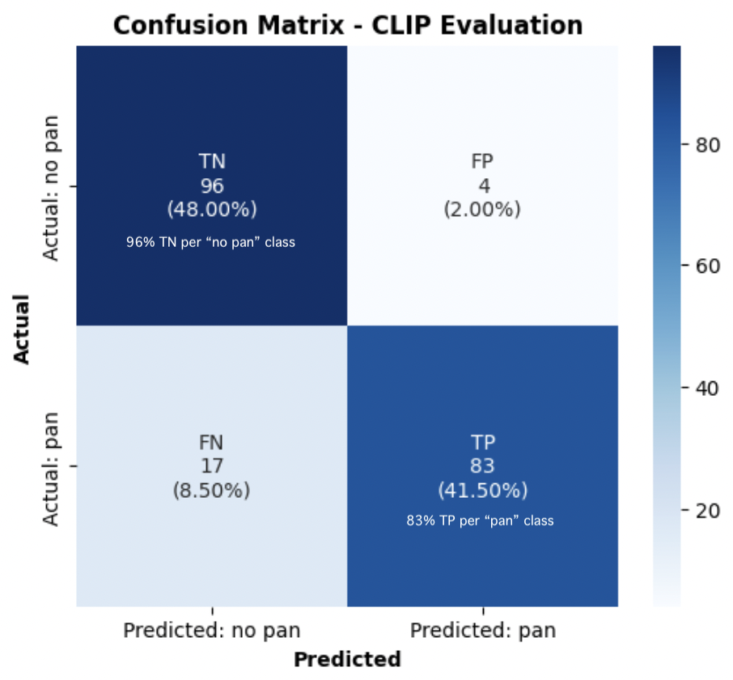
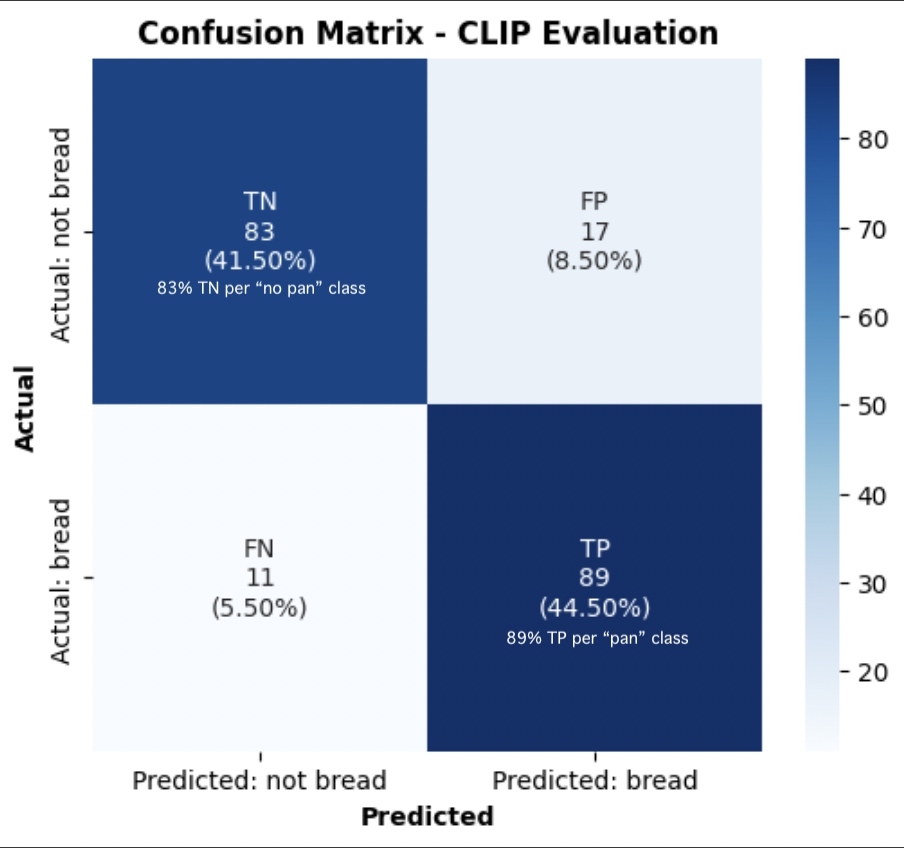

# Bread Classifier App 

This is the beta version of an application further aimed at **curating places where to eat foody-level food** just by analyzing and classifying visual objective features of food photos scrapped from public profiles of restaurants, bars and bakeries in Google Maps, Instagram, Pinterest, etc. 

Since each type of food has its own set of objective visual feautures when distinguishing if it is "foody-good" level or rather mediocre, the roadmap of the model training will be deployed by **vertical food types**, assessing and starting by the most popular food types in a main foodie cities worldwide (i.e. sushi, pizza, paella, tacos, etc.). 

The visual characteristics of each vertical or food type are being carefully identified, typified and latelly embbeded to classified food images using tag-based prompts, by a pool of selected well-known gastronomers and chefs in each city.

Within each food type and potentially for the first 5-10 food types to be analyzed-deployed until the model can infere food classes based on its collected visual knowledge from learning about enough previous food classes, we plan to develope a first filter of the model trained at distinguishing if the image belongs or not to the food type itself, before further classifying it as "foody-good" level or not.

We will start by the city of Barcelona and the food type "bread", taking in this case as a reference for the bread foody-level class, the objective visual features of a bread with a certain % of sourdoug (90% or more). 

In order to make super easy and fast to classify and tag images of bread =>90% sourdough bread or below, we have created a tinder-like app leveredging the gamification capabilities of this UI for chefs to be able to classify and tag images as though if they were playing cards (o looking for its other half :D)

* **Image classification Flask App** deployed using a temporary port url set up as public because of: 
  * A) incompatibilities with Torch & Transformers libraries and Render that didn't allow to deploy the app using a permanent url 
  * and B) High difficulty of setting up the Auth2 level process of Google Cloud Console to connect the Github Repository with the Drive Folders where the data is.
    * [Github Repository (/images folder ignored because it surpases github repo max storage with +20.000 images)](https://github.com/dianamonroe/pretrainfoodclassificationwidget)

  

  * [Temporary public bread classification and tagging app for chefs](https://5000-dianamonroe-pretrainfoo-2w8tlujr98p.ws-eu117.gitpod.io/)

As mentioned above, before training the model to accomplish its final goal (distinguishing foody-level class bread from bread than doesn't reach this food-level class), we had initially trained a 1st version of the model aimed at distinguishing what is bread of what is not, by + 10 rounds epochs (+500 epochs) training the **[Ultralytics Yolon11.pt model](https://docs.ultralytics.com/models/yolo11/#key-features)** pre-traiend with **[LVIS dataset](https://docs.ultralytics.com/datasets/detect/lvis/)** where bread is a class and there are + 18 not bread pastry classes. 

In order to do so, the data set had to be standarized to 640x640 pixels x 3 channels (RGB) and the Yolo labels including class and bounding boxes (location of the object in the image).
This labelling process was simplyfied by 
  - a) refining the dataset taking only to images where the bread and not_bread object was prominent (taking 80% of the image) and located in the center (.txt files with coinciding file name that the .jpg file contents "1 0.5 0.5 0.8 0.8", where "1" standas for the not_bread class, 0.5 and 0.5 points to a a center object location and 0.8 0.8 the prominence of the object in the image)
  - b) and reducing primarly the not_bread class images to mainly pastry-related not_bread food and other not_bread no pastry-related objects similar to bread.

After the 3rd training round, Yolo seemed to perform worst in every training round despite showing outstanding numerical above 94.8% for all -overall and pre class- metrics.

Unfortunatelly, Yolo trained model failed consistently in single image prediction test loading best weights from the trainning (even also after several intents of data refinement an until a 10th training round).
* [Repository of this 1st Yolon1.pt model converted to onnx in order to be deployed in a public STREAMLIT app](https://github.com/dianamonroe/gourmetfoodclassifierv1.2)).
* [Yolo11n.pt public Streamlit App](https://gourmetfoodclassifierv12.streamlit.app/)
* It for instance classifies a lemon as bread with a 40% confindence.

Since clearly Yolo11n.pt wasn't performing well in the single image test prediction, we had to switch to another model and trained OPEN AI CLIP model using 2 class prompts with quite better metrics in just the 1s training round.
Although numerical metrics of Yolo where way better thant OPEN AI CLIP:
* **CLIP 1st training round:**
  * Best Epoch: 50
  * Accuracy: 0.90
  * Precision: 0.95
  * Recall: 0.83

* **CLIP 2nd trainig round:**
  * Best Epoch: 10
  * Accuracy: 0.86
  * Precision: 0.84
  * Recall: 0.89

* Th current repository hosts the bread-not bread classifier model app desployment using Flask (the same system than for the pre-train classification app for chefs - Flask app deployed in a temporary port url because of Torch and Transformers non compatibility with Render)

# **PROJECT REPOSITORIES:**
You can request access to a bunch of repositories mainly done in Google Colab where the different phases of the project have been developed in the following Google Drive Folders:

* 1. [Image Scrapping](https://drive.google.com/drive/folders/1w28M03pW-V66UihSKkf1pyW0xMzToP8E?usp=drive_link)
* 2. [Data Preparation, Standardization, Augmentation & Refinement](https://drive.google.com/drive/folders/1ztH7bXBSfOYk5NEBFg91tBL2P8DUVCQw?usp=sharing)
* 3. [Model Training, Evaluation & Deployment](https://drive.google.com/drive/folders/1eLGwQrhMVTj-36B4KAG4cDRBVylq2vQS?usp=drive_link)
 
 Request acces to Yolo1 training rounds & evaluation
 [Request access to OPEN AI CLIP training rounds & evaluation](https://drive.google.com/file/d/1p9N38zwv3FTrn41g7O1fBrD4ZUZRVwMb/view?usp=drive_link)
    
