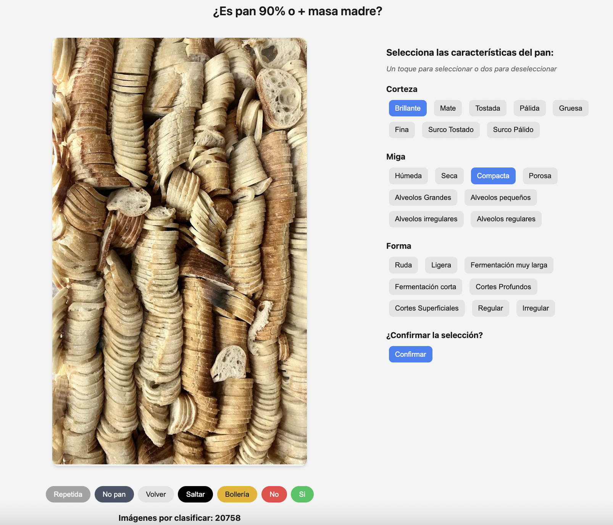
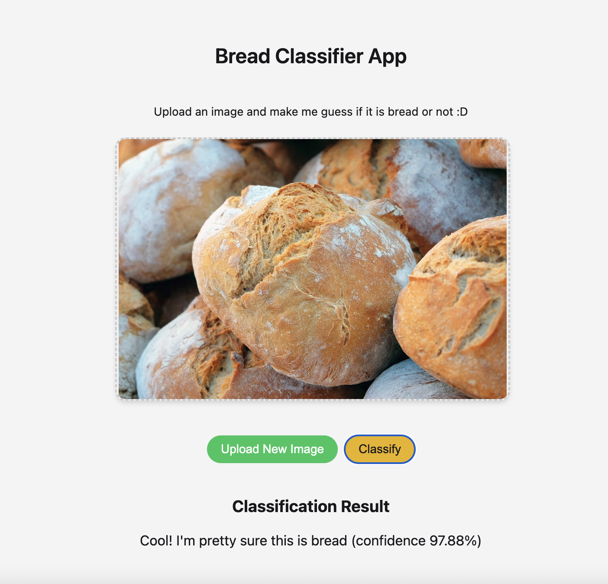

# Bread Classifier App 

This is the beta version of an application latelly aimed at discovering places where to eat great food (foody level) just by analyzing and classifying visual objective features of food images of public profiles of restaurants, bars and bakeries in Google maps, Instagram, Pinterest, etc. 

Since each type of food has its own set of objective visual feautures when distinguishing if it is "foody-good" level or rather mediocre, the roadmap of the model training will be divided by food classes, starting by the most popular food types in a city such as Barcelona. 

Within each food class (at least in the first food classes to be analyzed-deployed until the model can infere food classes based on collected visual knowledge of the initial food classes learned), we plan to develope a first filter of the model trained at distinguishing if the image belongs or not to the food class itself, before further classifying as "foody-good" level or not.

Starting by bread, we have trained a first version of the model aimed at distinguishing what is bread of what is not. After + 10 trainning rounds epochs (+500 epochs) training Ultralytics Yolon9.pt model pre-traiend with LVIS dataset (where bread is a class and there are + 18 not bread pastry classes) with pretty good numerical metrics (MMMMETRICAS), but failing badly in the single image test prediction ([1st Yolon9.pt model converted to onnx in order to be deployed in a public STREAMLIT app](https://gourmetfoodclassifierv12.streamlit.app/)), we have trained OPEN AI CLIP model using 2 class prompts with quite better metrics in just the 1s training round (EVALUACIÓN Y METRICASSSS CLIP)



## Global Ppoject Structure

* Image classification Flask App deployed using a temporary port url set up as public because of incompatibilities with Torch & Transformers libraries and Render that didn't allow to deploy the app using a permanent url
* [Github Repository (/images folder ignored because it surpases github repo max storage with +20.000 images)](https://github.com/dianamonroe/pretrainfoodclassificationwidget)
* [Temporary public bread classification and taggin app (for chefs)](https://5000-dianamonroe-pretrainfoo-2w8tlujr98p.ws-eu117.gitpod.io/)



* [Yolon9.pt public Streamlit App](https://gourmetfoodclassifierv12.streamlit.app/) - Previously trained model (good metrics but failed badly in single image predictions)


* Current repos¡itory -bread - not bread classifier model- structure (using the same system - Flask app deployed in a temporary port url because of Torch and Transformers non compatibility with Rendr)

The project is organized as follows:

- `app.py` - The main Python script that you run for your project.
- `explore.py` - A notebook to explore data, play around, visualize, clean, etc. Ideally the notebook code should be migrated to the app.py when moving to production.
- `utils.py` - This file contains utility code for operations like database connections.
- `requirements.txt` - This file contains the list of necessary python packages.
- `models/` - This directory should contain your SQLAlchemy model classes.
- `data/` - This directory contains the following subdirectories:
  - `interin/` - For intermediate data that has been transformed.
  - `processed/` - For the final data to be used for modeling.
  - `raw/` - For raw data without any processing.
 
    
## Setup

**Prerequisites**

Make sure you have Python 3.11+ installed on your. You will also need pip for installing the Python packages.

**Installation**

Clone the project repository to your local machine.

Navigate to the project directory and install the required Python packages:

```bash
pip install -r requirements.txt
```

**Create a database (if needed)**

Create a new database within the Postgres engine by customizing and executing the following command: `$ createdb -h localhost -U <username> <db_name>`
Connect to the Postgres engine to use your database, manipulate tables and data: `$ psql -h localhost -U <username> <db_name>`
NOTE: Remember to check the ./.env file information to get the username and db_name.

Once you are inside PSQL you will be able to create tables, make queries, insert, update or delete data and much more!

**Environment Variables**

Create a .env file in the project root directory to store your environment variables, such as your database connection string:

```makefile
DATABASE_URL="your_database_connection_url_here"
```

## Running the Application

To run the application, execute the app.py script from the root of the project directory:

```bash
python app.py
```

## Adding Models

To add SQLAlchemy model classes, create new Python script files inside the models/ directory. These classes should be defined according to your database schema.

Example model definition (`models/example_model.py`):

```py
from sqlalchemy.ext.declarative import declarative_base
from sqlalchemy import Column, Integer, String

Base = declarative_base()

class ExampleModel(Base):
    __tablename__ = 'example_table'
    id = Column(Integer, primary_key=True)
    name = Column(String)

```

## Working with Data

You can place your raw datasets in the data/raw directory, intermediate datasets in data/interim, and the processed datasets ready for analysis in data/processed.

To process data, you can modify the app.py script to include your data processing steps, utilizing pandas for data manipulation and analysis.

## Contributors

This template was built as part of the 4Geeks Academy [Data Science and Machine Learning Bootcamp](https://4geeksacademy.com/us/coding-bootcamps/datascience-machine-learning) by [Alejandro Sanchez](https://twitter.com/alesanchezr) and many other contributors. Find out more about [4Geeks Academy's BootCamp programs](https://4geeksacademy.com/us/programs) here.

Other templates and resources like this can be found on the school GitHub page.
