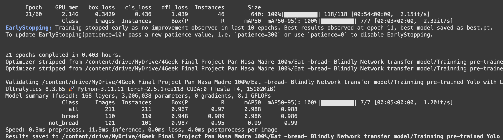
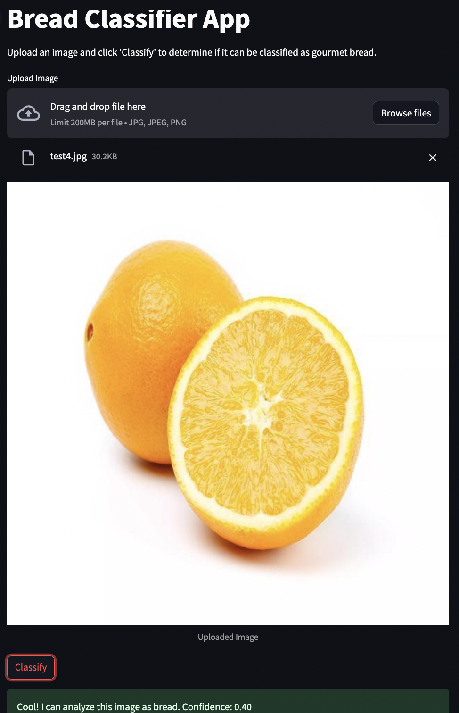

# Bread Classifier App 

This is the beta version of an application further aimed at curating places where to eat great food (foody level) just by analyzing and classifying visual objective features of food images from public profiles of restaurants, bars and bakeries in Google Maps, Instagram, Pinterest, etc. 

Since each type of food has its own set of objective visual feautures when distinguishing if it is "foody-good" level or rather mediocre, the roadmap of the model training will be deployed by **vertical food types**, assessing and starting by the most popular food types in a main foodie cities worldwide (i.e. sushi, pizza, paella, tacos, etc.). 

The visual characteristics of each vertical or food type are being carefully identified, typified and latelly embbeded to classified food images using tag-based prompts, by a pool of selected well-known gastronomers and chefs in each city.

Within each food type and potentially for the first 5-10 food types to be analyzed-deployed until the model can infere food classes based on its collected visual knowledge from learning about enough previous food classes, we plan to develope a first filter of the model trained at distinguishing if the image belongs or not to the food type itself, before further classifying it as "foody-good" level or not.

We will start by the city of Barcelona and the food type "bread", taking in this case as a reference for the bread foody-level class, the objective visual features of a bread with a certain % of sourdoug (90% or more). 
In order to make super easy and fast to classify and tag images of bread =>90% sourdough bread or below, we have created a tinder-like app leveredging the gamification capabilities of this UI for chefs to be able to classify and tag images as though if they were playing cards (o looking for its other half :D)

* **Image classification Flask App** deployed using a temporary port url set up as public because of: 
  * A) incompatibilities with Torch & Transformers libraries and Render that didn't allow to deploy the app using a permanent url 
  * and B) High difficulty of setting up the Auth2 level process of Google Cloud Console to connect the Github Repository with the Drive Folders where the data is.
    * [Github Repository (/images folder ignored because it surpases github repo max storage with +20.000 images)](https://github.com/dianamonroe/pretrainfoodclassificationwidget)

  

  * [Temporary public bread classification and tagging app for chefs](https://5000-dianamonroe-pretrainfoo-2w8tlujr98p.ws-eu117.gitpod.io/)

As mentioned above, before training the model for its final goal (distinguishing foody-level class bread from bread than doesn't reach this food-level class), we had initially trained a 1st version of the model aimed at distinguishing what is bread of what is not, 
by + 10 rounds epochs (+500 epochs) training the **[Ultralytics Yolon11.pt model](https://docs.ultralytics.com/models/yolo11/#key-features)** pre-traiend with **[LVIS dataset](https://docs.ultralytics.com/datasets/detect/lvis/)** where bread is a class and there are + 18 not bread pastry classes. 
In order to do so, the data set had to be standarized to 640x640 pixels x 3 channels (RGB) and the Yolo labels including class and bounding boxes (location of the object in the image).
This labelling process was simplyfied by 
  - a) refining the dataset taking only to images where the bread and not_bread object was prominent (taking 80% of the image) and located in the center (.txt files with coinciding file name that the .jpg file contents "1 0.5 0.5 0.8 0.8", where "1" standas for the not_bread class, 0.5 and 0.5 points to a a center object location and 0.8 0.8 the prominence of the object in the image)
  - b) and reducing primarly the not_bread class images to mainly pastry-related not_bread food and other not_bread no pastry-related objects similar to bread.

After 3rd training round Yolo showed outstanding numerical metrics above 90% (overall and pre class)




it failed consistently in single image prediction test (even also after several intents of data refinement until a 10th training round).
* [Repository of this 1st Yolon1.pt model converted to onnx in order to be deployed in a public STREAMLIT app](https://github.com/dianamonroe/gourmetfoodclassifierv1.2)).
* [Yolo11n.pt public Streamlit App](https://gourmetfoodclassifierv12.streamlit.app/)
* It for instance classifies a lemon as bread with a 40% confindence.



Since clearly Yolo11n.pt wasn't performing well in the single image test prediction, we had to switch to another model and trained OPEN AI CLIP model using 2 class prompts with quite better metrics in just the 1s training round (EVALUACIÓN Y METRICASSSS CLIP)
* Current repository - bread-not bread classifier model-structure (using the same system than for the pre-train classification app for chefs - Flask app deployed in a temporary port url because of Torch and Transformers non compatibility with Render)


Current repository project is organized as follows:

- `app.py` - The main Python script that you run for your project.
- `explore.py` - A notebook to explore data, play around, visualize, clean, etc. Ideally the notebook code should be migrated to the app.py when moving to production.
- `utils.py` - This file contains utility code for operations like database connections.
- `requirements.txt` - This file contains the list of necessary python packages.
- `models/` - This directory should contain your SQLAlchemy model classes.
- `data/` - This directory contains the following subdirectories:
  - `interin/` - For intermediate data that has been transformed.
  - `processed/` - For the final data to be used for modeling.
  - `raw/` - For raw data without any processing.
 
    
## Setup

**Prerequisites**

Make sure you have Python 3.11+ installed on your. You will also need pip for installing the Python packages.

**Installation**

Clone the project repository to your local machine.

Navigate to the project directory and install the required Python packages:

```bash
pip install -r requirements.txt
```

**Create a database (if needed)**

Create a new database within the Postgres engine by customizing and executing the following command: `$ createdb -h localhost -U <username> <db_name>`
Connect to the Postgres engine to use your database, manipulate tables and data: `$ psql -h localhost -U <username> <db_name>`
NOTE: Remember to check the ./.env file information to get the username and db_name.

Once you are inside PSQL you will be able to create tables, make queries, insert, update or delete data and much more!

**Environment Variables**

Create a .env file in the project root directory to store your environment variables, such as your database connection string:

```makefile
DATABASE_URL="your_database_connection_url_here"
```

## Running the Application

To run the application, execute the app.py script from the root of the project directory:

```bash
python app.py
```

## Adding Models

To add SQLAlchemy model classes, create new Python script files inside the models/ directory. These classes should be defined according to your database schema.

Example model definition (`models/example_model.py`):

```py
from sqlalchemy.ext.declarative import declarative_base
from sqlalchemy import Column, Integer, String

Base = declarative_base()

class ExampleModel(Base):
    __tablename__ = 'example_table'
    id = Column(Integer, primary_key=True)
    name = Column(String)

```

## Working with Data

You can place your raw datasets in the data/raw directory, intermediate datasets in data/interim, and the processed datasets ready for analysis in data/processed.

To process data, you can modify the app.py script to include your data processing steps, utilizing pandas for data manipulation and analysis.

## Contributors

This template was built as part of the 4Geeks Academy [Data Science and Machine Learning Bootcamp](https://4geeksacademy.com/us/coding-bootcamps/datascience-machine-learning) by [Alejandro Sanchez](https://twitter.com/alesanchezr) and many other contributors. Find out more about [4Geeks Academy's BootCamp programs](https://4geeksacademy.com/us/programs) here.

Other templates and resources like this can be found on the school GitHub page.
